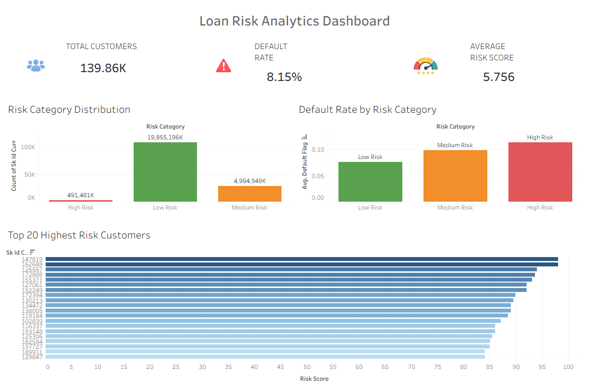
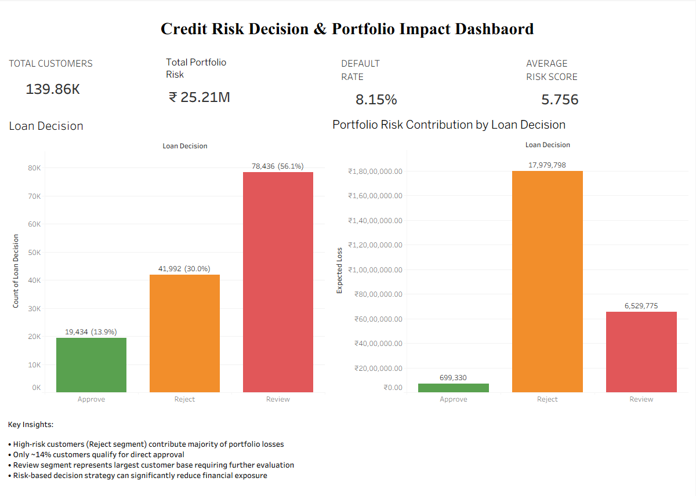

## 📊 Credit Risk Analytics: From Risk Scoring to Decision System

End-to-end credit risk analytics project evolving from a traditional risk dashboard to a financial decision-making system.

* Predict default probability (PD)
* Estimate financial risk (Expected Loss)
* Enable loan approval decisions

---

## 🚀 Key Highlights

* Built end-to-end pipeline using SQL, Python, and Tableau
* Developed logistic regression model for default prediction
* Implemented financial risk modeling (PD × LGD × EAD)
* Estimated portfolio risk (~₹25M+ expected loss)
* Designed loan decision system (Approve / Review / Reject)

---

## 🎯 Business Objective

To build a data-driven credit risk system that enables financial institutions to:

* Identify high-risk customers
* Predict loan default probability
* Quantify financial exposure
* Improve loan approval and portfolio risk decisions

---

## 🔹 Version 1: Risk Analytics Dashboard

**Focus:**

* Risk segmentation
* Default rate analysis

**Key Features:**

* Risk category distribution (Low / Medium / High)
* Default rate by risk segment
* High-risk customer identification
* KPI dashboard

---

## 🔹 Version 2: Credit Risk Decision System (Final)

**Focus:**

* Predictive modeling
* Financial risk estimation
* Decision-based analytics

**Key Features:**

* Default probability prediction using Logistic Regression
* Expected Loss calculation
* Loan decision segmentation (Approve / Review / Reject)
* Portfolio risk analysis

---

## 📉 Financial Modeling

**Expected Loss = PD × LGD × EAD**

* **PD (Probability of Default):** Predicted using ML model
* **LGD (Loss Given Default):** Assumed 50%
* **EAD (Exposure at Default):** Total exposure amount

---

## 📊 Dashboard

### Version 1:

* Risk category distribution
* Default rate analysis
* High-risk customer identification

### Version 2:

* Loan decision distribution
* Portfolio risk (Expected Loss)
* Financial impact by segment
* Decision-driven insights

## 📷 Dashboard Preview

### Version 1: Risk Analytics Dashboard

### Version 2: Credit Risk Decision Dashboard

---

## 📌 Key Insights

* High-risk customers (Reject segment) contribute majority of portfolio losses
* Only ~14% customers qualify for direct approval
* Review segment represents largest customer base requiring further evaluation
* Risk-based decision strategy significantly reduces financial exposure

---

## 🏗️ Data Architecture

* Raw Tables: application_train, bureau, previous_application, installments_payments
* Staging Tables: cleaned and transformed datasets
* Star Schema: fact and dimension tables for analytics

---

## 🔄 Project Workflow

SQL Data Extraction → Data Cleaning (Python) → Feature Engineering →
Risk Scoring → Machine Learning → Financial Modeling → Dashboard Visualization

---

## 🛠️ Tech Stack

SQL | Python | Pandas | NumPy | Scikit-learn | Tableau | MySQL

---

## 📁 Project Structure

/data
/sql
/python
/tableau
/screenshots

---

## ✅ Outcome

Developed a credit risk decision system that enables data-driven loan approvals and portfolio risk optimization.

